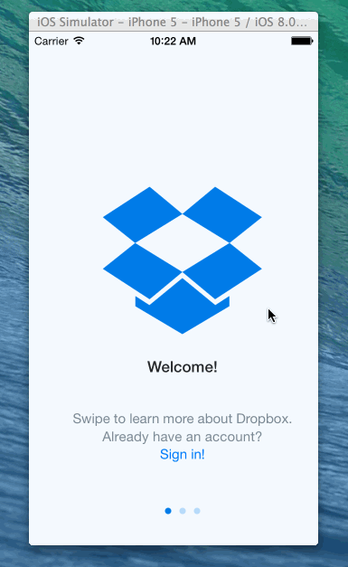

How many hours did it take to complete?

9

Which required and optional stories have you completed?

Add UITextFields for the forms so you can actually type in them and handle dismissing the keyboard.

You should be able to swipe through the welcome screens instead of just tapping them 
Note: I implemented the code for this and I had it working at one point but for some reason it just all of sudden stopped recognizing the gestures. Could it be an issue with the simulator?

